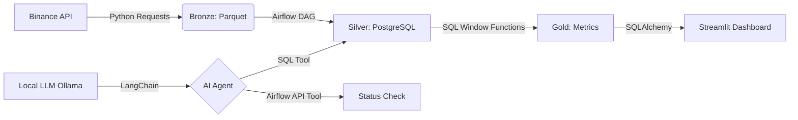
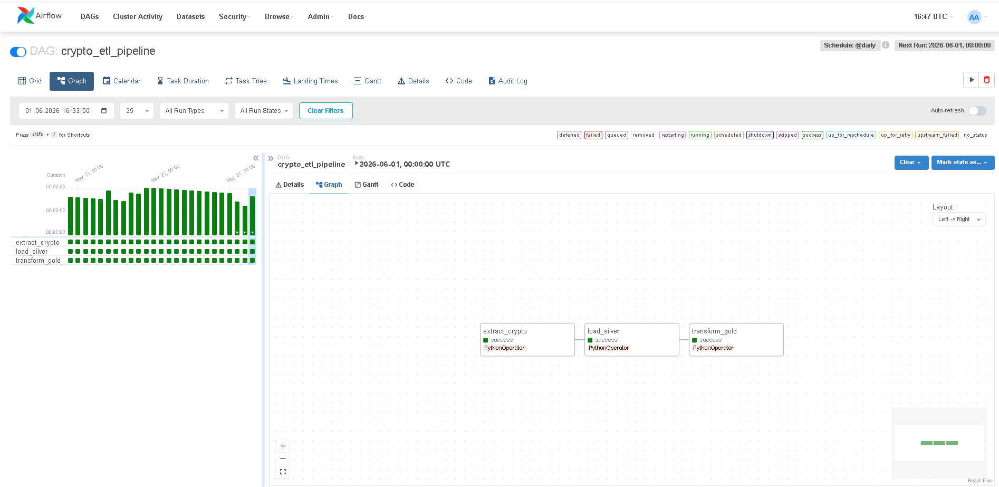
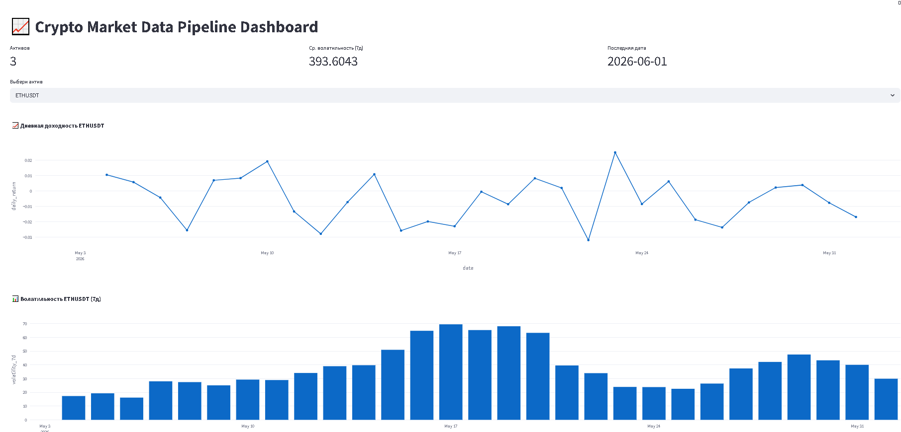
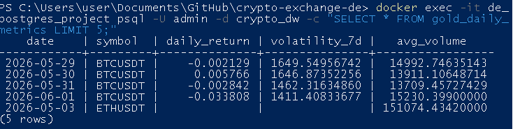

# 📈 Crypto Exchange Data Pipeline

End-to-end ETL пайплайн для сбора, обработки и визуализации рыночных данных криптовалют, дополненный локальным ИИ-ассистентом для автоматизации DE-задач.
Проект демонстрирует навыки построения надежных данных конвейеров, работы с таймсериями и автоматизации процессов.

## 🏗️ Архитектура


## 🛠️ Технологический стек

*   **Orchestration**: Apache Airflow 2.7 (Docker)
*   **Storage**: PostgreSQL 15
*   **Processing**: Python (Pandas), SQL (Window Functions, CTE)
*   **AI Automation**: LangChain, Ollama (Llama 3.2), Custom Tools
*   **Visualization**: Streamlit, Plotly
*   **Infrastructure**: Docker, Docker Compose
*   **Key Concepts**: ETL, Idempotency, Data Quality, Star Schema, Time Series Analysis, Local LLM Inference

**🚀 Быстрый старт**
**1. Запуск инфраструктуры**

docker compose up -d

⏳ Подождите ~60 секунд, пока Airflow полностью запустится.

### 2. Настройка Airflow

1. Откройте [http://localhost:8080](http://localhost:8080) (логин/пароль: `admin` / `admin`).
2. Перейдите в **Admin → Connections → +**.
3. Создайте новое подключение со следующими параметрами:
   * **Connection Id**: `postgres_default`
   * **Connection Type**: `Postgres`
   * **Host**: `postgres-project`
   * **Schema**: `crypto_dw`
   * **Login**: `admin`
   * **Password**: `secret`
   * **Port**: `5432`

### 3. Запуск пайплайна

1. Включите тумблер у DAG `crypto_etl_pipeline`.
2. Нажмите **▶️ Trigger DAG**.
3. Дождитесь, пока все задачи станут зелеными ✅.

### 4. Запуск дашборда

> ⚠️ **Важно:** Мы используем порт **5433**, чтобы избежать конфликтов с локальным PostgreSQL.

```bash
pip install streamlit plotly sqlalchemy pg8000
streamlit run dashboard/app.py
```
Откройте http://localhost:8501.
📊 Метрики и трансформации
Daily Return: (close - prev_close) / prev_close
Volatility (7d): STDDEV(close) OVER (ROWS 6 PRECEDING)
Avg Volume (7d): Скользящее среднее объема торгов

## 🤖 Локальный ИИ-ассистент
Ассистент работает полностью оффлайн (без облачных API), умеет писать SQL к БД и проверять статус пайплайнов в Airflow.
Требования: Ollama + langchain + langchain-ollama
```bash
ollama pull llama3.2
pip install langchain langchain-openai langchain-community langchain-ollama requests
python scripts/ai_agents/agent_sql.py
```
### Примеры вопросов:
   * Сколько строк в gold_daily_metrics?
   * Покажи топ-3 актива по волатильности
   * Проверь статус DAG crypto_etl_pipeline

## ✅ Data Quality Checks

Пайплайн включает автоматические проверки:
* Отсутствие NULL значений в ключевых метриках.
* Проверка на отрицательную волатильность.
* Валидация цен (`close > 0`).

## 🔮 Future Improvements

* Интеграция с Kafka для real-time данных.
* Использование dbt для управления трансформациями.
* Деплой дашборда в облако (Streamlit Cloud).
* Добавление тестов данных через Great Expectations.
* Добавление алертов в Telegram при падении DAG

## 📷 Результаты




